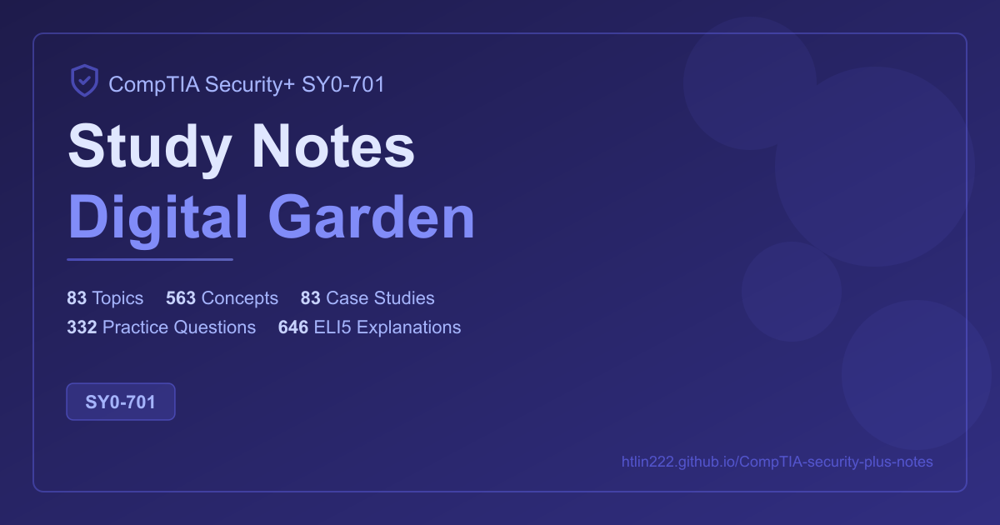

# CompTIA Security+ SY0-701 Study Notes

[](https://github.com/htlin222/CompTIA-security-plus-notes/actions/workflows/deploy.yaml)



A comprehensive **digital garden** for the CompTIA Security+ SY0-701 exam, built with [Quartz 4](https://quartz.jzhao.xyz/) and published as an interconnected knowledge base.

**Live site:** https://htlin222.github.io/CompTIA-security-plus-notes

## What's Inside

| Content Layer | Count | Description |
|---------------|-------|-------------|
| Topics | 83 | Core topic pages covering all 5 exam domains |
| Concepts | 563 | Granular concept definitions with wikilinks |
| Case Studies | 83 | Real-world scenario analyses |
| Practice Questions | 332 | Exam-style MCQs with click-to-reveal answers |
| ELI5 Explanations | 646 | Beginner-friendly "Explain Like I'm 5" callouts |

## Exam Domains

| Domain | Topics | Weight |
|--------|--------|--------|
| 1.0 General Security Concepts | 14 | 12% |
| 2.0 Threats, Vulnerabilities & Mitigations | 15 | 22% |
| 3.0 Security Architecture | 20 | 18% |
| 4.0 Security Operations | 20 | 28% |
| 5.0 Security Program Management & Oversight | 14 | 20% |

## Features

- **Interconnected notes** — 3,000+ wikilinks between topics, concepts, and cases
- **Graph view** — visual exploration of relationships between security concepts
- **Q-Bank** — 332 scenario-based multiple-choice questions with collapsed answers and full explanations
- **ELI5 callouts** — beginner-friendly analogies on every topic and concept page
- **Full-text search** — find any concept instantly
- **Responsive** — works on desktop and mobile

## Local Development

```bash
git clone https://github.com/htlin222/CompTIA-security-plus-notes.git
cd CompTIA-security-plus-notes
npm ci
npx quartz build --serve
```

Open http://localhost:8080 to view locally.

## Project Structure

```
content/
  domain-1-general-security/       # 14 topics + concepts/ + cases/
  domain-2-threats-vulnerabilities/ # 15 topics + concepts/ + cases/
  domain-3-security-architecture/   # 20 topics + concepts/ + cases/
  domain-4-security-operations/     # 20 topics + concepts/ + cases/
  domain-5-program-management/      # 14 topics + concepts/ + cases/
  glossary.md
quartz/
  styles/custom.scss                # Domain colors, ELI5/Q-Bank callout styles
```

## License

Content is provided for educational purposes. The Quartz framework is [MIT licensed](https://github.com/jackyzha0/quartz/blob/v4/LICENSE.txt).

## Citation

If you find these notes useful, please cite:

```bibtex
@misc{lin2026securityplus,
  author       = {Lin, Hsieh-Ting},
  title        = {CompTIA Security+ SY0-701 Study Notes Digital Garden},
  year         = {2026},
  publisher    = {GitHub Pages},
  url          = {https://htlin222.github.io/CompTIA-security-plus-notes}
}
```
